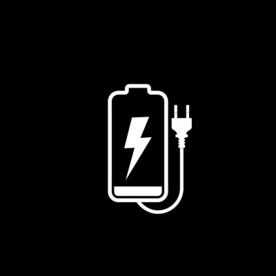
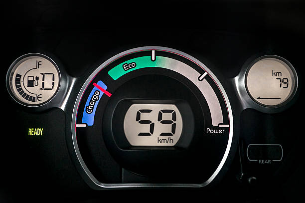

<!DOCTYPE html>
<html lang="en">

<head>
    <meta charset="utf-8">
    <meta name="viewport" content="width=device-width, initial-scale=1">
    <title>evdp</title>

    <!-- Google Font: Source Sans Pro -->
    <link rel="stylesheet" href="https://fonts.googleapis.com/css?family=Source+Sans+Pro:300,400,400i,700&display=fallback">
    <!-- Font Awesome Icons -->
    <link rel="stylesheet" href="plugins/fontawesome-free/css/all.min.css">
    <!-- overlayScrollbars -->
    <link rel="stylesheet" href="plugins/overlayScrollbars/css/OverlayScrollbars.min.css">
    <!-- Theme style -->
    <link rel="stylesheet" href="dist/css/adminlte.min.css">

</head>

<body class="hold-transition dark-mode sidebar-mini layout-fixed layout-navbar-fixed layout-footer-fixed">
    

        <!-- Preloader -->
        

            
        

        <!-- Navbar -->
        <nav class="main-header navbar navbar-expand navbar-dark">
            <!-- Left navbar links -->
            <ul class="navbar-nav">
                <li class="nav-item">
                    <a class="nav-link" data-widget="pushmenu" href="#" role="button"><i class="fas fa-bars"></i></a>
                </li>
                <li class="nav-item d-none d-sm-inline-block">
                    <a href="#" class="nav-link">Home</a>
                </li>
                <li class="nav-item d-none d-sm-inline-block">
                    <a href="#" class="nav-link">Signup</a>
                </li>

                <!-- 
                <li class="nav-item d-none d-sm-inline-block">
                    <a href="#" class="nav-link">See Pricing</a>
                </li> -->

            </ul>

            <!-- Right navbar links -->
            <ul class="navbar-nav ml-auto">
                <!-- Navbar Search -->
                <!-- <li class="nav-item">

                    <a class="btn btn-success" onclick=r(); href="#">Direction</a>

                </li> -->

                <!-- Messages Dropdown Menu -->

                <!-- Notifications Dropdown Menu -->
                <li class="nav-item d-none d-sm-inline-block">
                    <a href="#" class="nav-link">Login</a>
                </li>

            </ul>
        </nav>
        <!-- /.navbar -->

        <!-- Main Sidebar Container -->
        <aside class="main-sidebar sidebar-dark-primary elevation-4">
            <!-- Brand Logo -->
            <a href="#" class="brand-link">
                <!--  -->

                <i class="fa fa-spinner fa-pulse fa-1.5x fa-fw"></i>
                </i> EVDP
                <i class="fas fa-truck-monster"></i>
            </a>

            <!-- Sidebar -->
            

                <!-- Sidebar user panel (optional) -->
                

                    <!-- 

                        
                    
 -->
                    

                        <a href="#" class="d-block">&nbsp;&nbsp;&nbsp;&nbsp;&nbsp;&nbsp;<i class="fas fa-truck-monster"></i> &nbsp;TATA Nexon</a>

                        <i class="fa fa-cog fa-spin fa-3x fa-fw"></i>
                        <i class="fa fa-cog fa-spin fa-3x fa-fw"></i>
                    

                

                <!-- SidebarSearch Form -->

                <!-- Sidebar Menu -->
                <nav class="mt-2">
                    <ul class="nav nav-pills nav-sidebar flex-column" data-widget="treeview" role="menu" data-accordion="false">
                        <!-- Add icons to the links using the .nav-icon class
               with font-awesome or any other icon font library -->
                        <li class="nav-item menu-open">
                            <!-- <a href="" class="nav-link active">
                                <i class="nav-icon fas fa-tachometer-alt"></i>
                                

                                    Find Station
                                    <i class="right fas fa-angle-left"></i>
                                

                            </a>

                            <ul class="nav nav-treeview">

                            </ul> -->
                            <!-- <li class="nav-item">
                                    <a href="neareststn.html" class="nav-link">
                                        <i class="fas fa-circle nav-icon"></i>
                                        
Find Now

                                    </a>
                                </li> -->
                            <li class="nav-header">Low Power Service</li>
                            <li class="nav-item">
                                <a href="neareststn.html" class="nav-link">
                                    <i class="nav-icon fa fa-charging-station"></i>
                                    
Find Station

                                </a>
                            </li>
                            <li class="nav-item">
                                <a href="#" class="nav-link" disabled>
                                    <i class="nav-icon fa fa-car"></i>
                                    
Drive Now

                                </a>
                            </li>
                            <li class="nav-item">
                                <a href="book.html" class="nav-link">
                                    <i class="nav-icon far fa-edit"></i>
                                    
Book a Slot

                                </a>
                            </li>

                    </ul>
                </nav>
                <!-- /.sidebar-menu -->
            

            <!-- /.sidebar -->
        </aside>

        <!-- Content Wrapper. Contains page content -->
        

            <!-- Content Header (Page header) -->
            

                

                    

                        

                            <h1 class="m-0">Electric Vehicle Dashboard</h1>
                        

                        <!-- /.col -->
                        <!-- /.col -->
                    

                    <!-- /.row -->
                

                <!-- /.container-fluid -->
            

            <!-- /.content-header -->

            <!-- Main content -->
            <section class="content">
                

                    <!-- Info boxes -->
                    

                        

                            

                                <i class="fas fa-battery-full"></i>

                                

                                    Battery Power
                                    
                  90
                  <small>%</small>
                
                                

                                <!-- /.info-box-content -->
                            

                            <!-- /.info-box -->
                        

                        <!-- /.col -->
                        

                            

                                <i class="fas fa-clock"></i>

                                

                                    Last Charged
                                    6:10 AM
                                

                                <!-- /.info-box-content -->
                            

                            <!-- /.info-box -->
                        

                        <!-- /.col -->

                        <!-- fix for small devices only -->
                        

                        

                            

                                <i class="fas fa-road"></i>

                                

                                    Trip
                                    76 KM
                                

                                <!-- /.info-box-content -->
                            

                            <!-- /.info-box -->
                        

                        <!-- /.col -->
                        

                            

                                <i class="fas fa-music"></i>

                                

                                    Music
                                    2,000
                                

                                <!-- /.info-box-content -->
                            

                            <!-- /.info-box -->
                        

<!--                          -->
                        <!-- /.col -->
                    

                    <!-- /.row -->

                    <!-- Control Sidebar -->
                    <aside class="control-sidebar control-sidebar-dark">
                        <!-- Control sidebar content goes here -->
                    </aside>
                    <!-- /.control-sidebar -->

                    <!-- Main Footer -->
                    <footer class="main-footer">
                        <strong>Copyright &copy; 2022-2023 EVDP.</strong> All rights reserved.
                        

                            <b>Version</b> 1.0
                        

                    </footer>
                

                <!-- ./wrapper -->

                <!-- REQUIRED SCRIPTS -->
                <!-- jQuery -->
                
                <!-- Bootstrap -->
                
                <!-- overlayScrollbars -->
                
                <!-- AdminLTE App -->
                

                <!-- PAGE PLUGINS -->
                <!-- jQuery Mapael -->
                
                
                
                
                <!-- ChartJS -->
                

</body>

</html>
